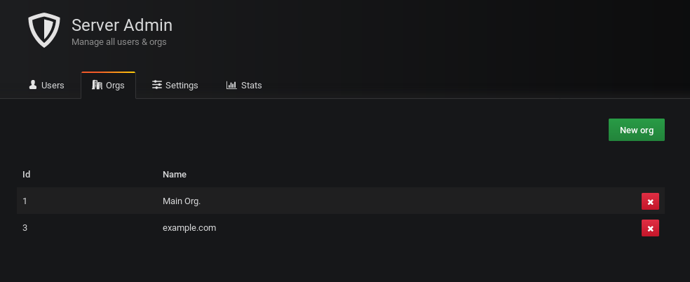
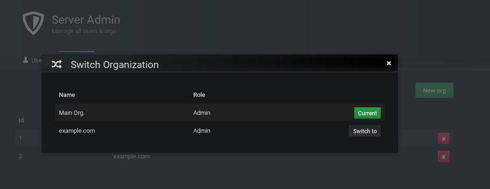
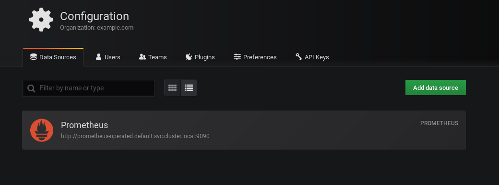
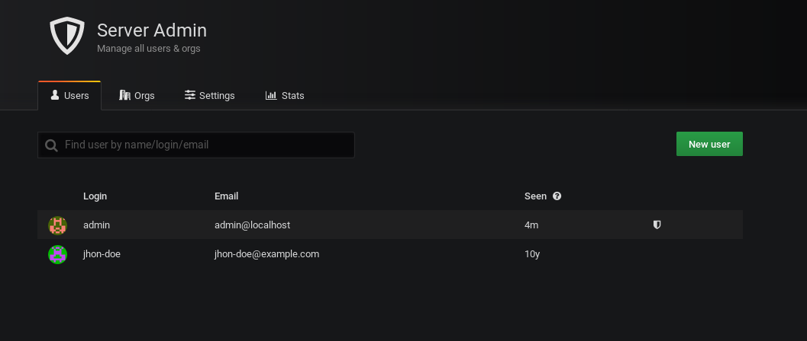
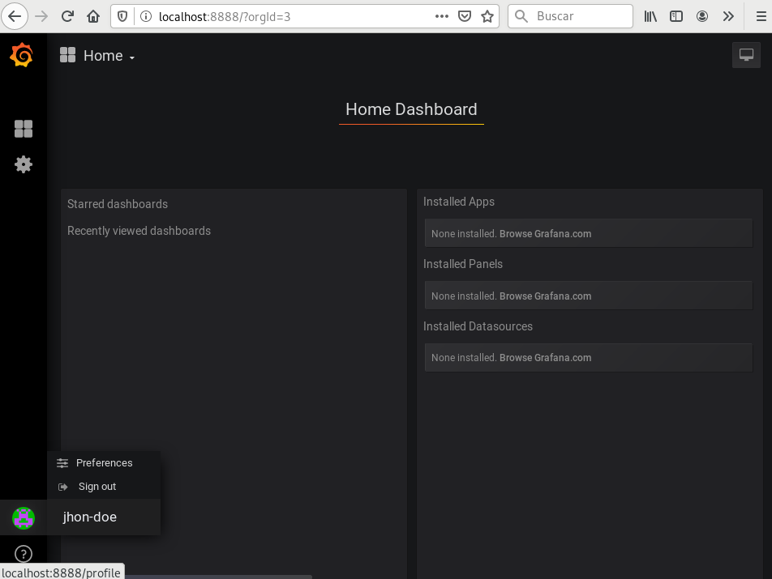

# Quick Start

The quick start guide walks through the process of setting up RBAC, operator deployment 
and creating a Grafana Organization with an associated User.

## Prerequisites

- [Grafana instance](https://github.com/grafana/grafana).
    - Admin user *(basic auth)* credentials.
- Access to a [Kubernetes Cluster](https://github.com/kubernetes/kubernetes)
    - [kubectl](https://github.com/kubernetes/kubectl)


Setup RBAC for the Grafana multi-tenant operator and its related resources:

```bash
$ kubectl create -f deploy/service_account.yaml
serviceaccount/grafana-multi-tenant-operator created
$ kubectl create -f deploy/role.yaml
role.rbac.authorization.k8s.io/grafana-multi-tenant-operator created
$ kubectl create -f deploy/role_binding.yaml
rolebinding.rbac.authorization.k8s.io/grafana-multi-tenant-operator created
```

Deploy the Grafana multi-tenant CRDs:

```
$ kubectl create -f deploy/crds.yaml
customresourcedefinition.apiextensions.k8s.io/organizations.grafana.k8spin.cloud created
customresourcedefinition.apiextensions.k8s.io/users.grafana.k8spin.cloud created
```

Before deploying the Grafana multi tenant operator, create a secret with the following variables:

- `GRAFANA_MULTI_TENANT_OPERATOR_HOST`: [REQUIRED] Grafana endpoint. *Example: `grafana.monitoring.svc.cluster.local:3000`*
- `GRAFANA_MULTI_TENANT_OPERATOR_ADMIN_USERNAME`: [OPTIONAL] Admin user. Default value: `admin`.
- `GRAFANA_MULTI_TENANT_OPERATOR_ADMIN_PASSWORD`: [REQUIRED] Admin user password.

```bash
$ kubectl create secret generic grafana-multi-tenant-operator \
    --from-literal=GRAFANA_MULTI_TENANT_OPERATOR_HOST=my_grafana_host \
    --from-literal=GRAFANA_MULTI_TENANT_OPERATOR_ADMIN_USERNAME=admin \
    --from-literal=GRAFANA_MULTI_TENANT_OPERATOR_ADMIN_PASSWORD=my_admin_password
```

Deploy the Grafana multi tenant operator:

```bash
$ kubectl create -f deploy/operator.yaml
```

Verify that Grafana multi tenant operator is up and running:

```bash
$ kubectl get deployment
NAME                            READY   UP-TO-DATE   AVAILABLE   AGE
grafana-multi-tenant-operator   1/1     1            1           13h
```

## Create an example Organization

Create an Organization

```bash
$ kubectl apply -f examples/example.com-grafana-org.yaml
organization.grafana.k8spin.cloud/example.com created
```

Verify the Organization CR contains an Grafana Organization identifier:

```bash
$ kubectl describe org example.com
$ echo "Parsing with jq"
"Parsing with jq"
$ kubectl get org example.com -o json | jq -r .status.create_organization.orgId
3
```

You can also see it at `my_grafana_host` site:



Edit the Organization cr adding a datasource:

```bash
$ kubectl edit org example.com
organization.grafana.k8spin.cloud/example.com edited
$ kubectl get org example.com -o yaml
apiVersion: grafana.k8spin.cloud/v1
kind: Organization
metadata:
  finalizers:
  - kopf.zalando.org/KopfFinalizerMarker
  name: example.com
  namespace: default
spec:
  datasources:
  - data: |
      {
        "name": "Prometheus",
        "type": "prometheus",
        "access": "proxy",
        "url": "http://prometheus-operated.default.svc.cluster.local:9090",
        "basicAuth": false
      }
    name: Prometheus
```

Switch to the example.com organization and navigate to datasources:





## Create an example User

Create an User

```bash
$ kubectl apply -f examples/example.com-grafana-user.yaml
user.grafana.k8spin.cloud/jhon-doe created
```

Verify the User CR contains an User Organization identifier:

```bash
$ kubectl  describe user jhon-doe
$ echo "Parsing with jq"
"Parsing with jq"
$ kubectl  get user jhon-doe -o json | jq -r .status.create_user.id
2
```

You can also see it at `my_grafana_host` site:




Edit the User cr adding the user to the example.com organization:

```bash
$ kubectl edit user jhon-doe
user.grafana.k8spin.cloud/jhon-doe edited
$ kubectl get user jhon-doe -o yaml
apiVersion: grafana.k8spin.cloud/v1
kind: User
metadata:
  finalizers:
  - kopf.zalando.org/KopfFinalizerMarker
  name: jhon-doe
  namespace: default
spec:
  email: jhon-doe@example.com
  organizations:
  - example.com
```

Check the User at `my_grafana_host` site:


Use the user to login at `my_grafana_host` site:

- User: `jhon-doe`
- Password: `changemeplease`




### Clean up

Delete both organization and user

```bash
$ kubectl delete -f examples/example.com-grafana-user.yaml
user.grafana.k8spin.cloud "jhon-doe" deleted
$ kubectl delete -f examples/example.com-grafana-org.yaml
organization.grafana.k8spin.cloud "example.com" deleted
```